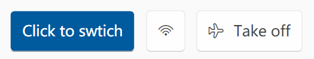

# Usage - LazyWpf

这些例子都可以在 `LazyWpf.Test` 中找到。

首先需要导入命名空间：

```xml
xmlns:lazy="clr-namespace:LazyWpf;assembly=LazyWpf"
```

```csharp
using LazyWpf;
```

### Contents

- [Button](#Button)
- [MsgBox](#MsgBox)
- [ProgBar](#ProgBar)


## Button

- 通过 `IsAccented` 属性控制是否使用强调色
- 轻松实现带图标的按钮

### Examples

1. 纯文本按钮

   ```xml
   <lazy:Button Text="Click to swtich" Height="40" IsAccented="True"/>
   ```

2. 图标按钮

   ```xml
   <lazy:Button Icon="&#xE701;" Height="40"/>
   ```

3. 图标 + 文字按钮

   ```xml
   <lazy:Button Icon="&#xE709;" Text="Take off" Height="40"/>
   ```

   

## MsgBox

- 符合 Fluent Design 的对话框（相对于 Win10 自带），更美观
- 可以自定义强调的按钮
- 按钮文本国际化（目前只有 English、简体中文）

### Example

```csharp
var msgBox = new MsgBox(
    "Do you want a dessert?",  // 对话框文本
    "Question",                // 对话框标题
    MbOpt.YesNoCancel,         // 按扭组合 (MbOpt 枚举)
    MbBtn.Yes,                 // 强调的按钮 (MbBtn 枚举)
    MbIco.Info                 // 显示的图标 (会影响提示音, MbIco 枚举)
) { Owner = this };
```


## ProgBar

- 值改变时的平滑动画

### Example

```xml
<lazy:ProgBar Margin="5" Height="5" Minimum="0" Maximum="100"
              Value="{Binding ElementName=Slider, Path=Value}" Background="LightGray"/>
```

外观与原生控件一致，此处图略。

